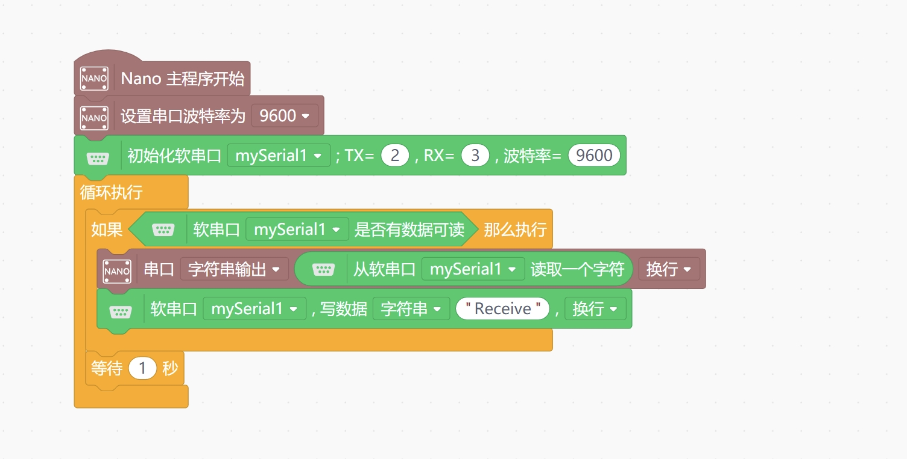

# Lono Mind+ SoftwareSerial

---------------------------------------------------------

## Summary
This is an extension implementation of Mind+ SoftwareSerial, supporting flexible pin selection and providing basic SoftwareSerial initialization, read, and write functions.

## Blocks

## Examples

## License

MIT

## Supported targets

Board                | JavaScript    | Arduino   | MicroPython    | Remarks
------------------ | :----------: | :----------: | :---------: | -----
Arduino UNO        |             |       √       |             | 
Arduino nano        |             |        √      |             |    
ESP32        |             |        √      |             |    

## Release Logs
* V0.0.1  Supports SoftwareSerial basic usage, etc. init SoftwareSerial,read,write